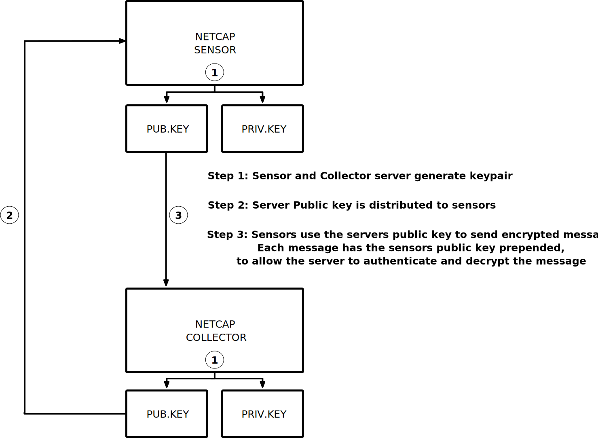

# Distributed Collection

## Collection Server

Using Netcap as a data collection mechanism, sensor agents can be deployed to export the traffic they see to a central collection server. This is especially interesting for internet of things \(IoT\) applications, since these devices are placed inside isolated networks and thus the operator does not have any information about the traffic the device sees. Although Go was not specifically designed for this application, it is an interesting language for embedded systems. Each binary contains the complete runtime, which increases the binary size but requires no installation of dependencies on the device itself. Data exporting currently takes place in batches over UDP sockets. Transferred data is compressed in transit and encrypted with the public key of the collection server. Asymmetric encryption was chosen, to avoid empowering an attacker who compromised a sensor, to decrypt traffic of all sensors communicating with the collection server. To increase the performance, in the future this could be replaced with using a symmetric cipher, together with a solid concept for key rotation and distribution. Sensor agents do not write any data to disk and instead keep it in memory before exporting it.


As described in the concept chapter, sensors and the collection server use UDP datagrams for communication. Network communication was implemented using the go standard library. This section will focus on the procedure of encrypting the communication between sensor and collector. For encryption and decryption, cryptographic primitives from the [golang.org/x/crypto/nacl/box](https://godoc.org/golang.org/x/crypto/nacl/box) package are used. The NaCl \(pronounced 'Salt'\) toolkit was developed by the reowned cryptographer Daniel J. Bernstein. The box package uses _Curve25519_, _XSalsa20_ and _Poly1305_ to encrypt and authenticate messages.

It is important to note that the length of messages is not hidden. Netcap uses a thin wrapper around the functionality provided by the nacl package, the wrapper has been published here: [github.com/dreadl0ck/cryptoutils](https://www.github.com/dreadl0ck/cryptoutils).

## Batch Encryption

The collection server generates a keypair, consisting of two 32 byte \(256bit\) keys, hex encodes them and writes the keys to disk. The created files are named _pub.key_ and _priv.key_. Now, the servers public key can be shared with sensors. Each sensor also needs to generate a keypair, in order to encrypt messages to the collection server with their private key and the public key of the server. To allow the server to decrypt and authenticate the message, the sensor prepends its own public key to each message.



## Batch Decryption

When receiving an encrypted batch from a sensor, the server needs to trim off the first 32 bytes, to get the public key of the sensor. Now the message can be decrypted, and decompressed. The resulting bytes are serialized data for a batch protocol buffer. After unmarshalling them into the batch structure, the server can append the serialized audit records carried by the batch, into the corresponding audit record file for the provided client identifier.


## Usage

Both sensor and client can be configured by using the _-addr_ flag to specify an IP address and port. To generate a keypair for the server, the _-gen-keypair_ flag must be used:

```text
$ netcap-server -gen-keypair 
wrote keys
$ ls
priv.key pub.key
```

Now, the server can be started, the location of the file containing the private key must be supplied:

```text
$ netcap-server -privkey priv.key -addr 127.0.0.1:4200
```

The server will now be listening for incoming messages. Next, the sensor must be configured. The keypair for the sensor will be generated on startup, but the public key of the server must be provided:

```text
$ netcap-sensor -pubkey pub.key -addr 127.0.0.1:4200
got 126 bytes of type NC_ICMPv6RouterAdvertisement expected [126] got size [73] for type NC_Ethernet
got 73 bytes of type NC_Ethernet expected [73]
got size [27] for type NC_ICMPv6
got size [126] for type NC_ICMPv6RouterAdvertisement
got 126 bytes of type NC_ICMPv6RouterAdvertisement expected [126] got size [75] for type NC_IPv6
got 75 bytes of type NC_IPv6 expected [75]
got 27 bytes of type NC_ICMPv6 expected [27]
```

The client will now collect the traffic live from the specified interface, and send it to the configured server, once a batch for an audit record type is complete. The server will log all received messages:

```text
$ netcap-server -privkey priv.key -addr 127.0.0.1:4200 
packet-received: bytes=2412 from=127.0.0.1:57368 decoded batch NC_Ethernet from client xyz
new file xyz/Ethernet.ncap
packet-received: bytes=2701 from=127.0.0.1:65050 decoded batch NC_IPv4 from client xyz
new file xyz/IPv4.ncap
...
```

When stopping the server with a _SIGINT_ \(Ctrl-C\), all audit record file handles will be flushed and closed properly.

